## Exercise 1.1 - Log into Advanced Event Mesh and explore it

After completing these steps you will have familiarized yourself with AEM.

1. Log into Advanced Event Mesh

Link: https://eu10.console.pubsub.em.services.cloud.sap/login?zone-id=908a280d-c2f1-4d2b-b003-de94ffc5a4ee

User: handson_***@education.cloud.sap (replace *** with your user number)

Password: provided by your moderator

2. Explore Advanced Event Mesh  

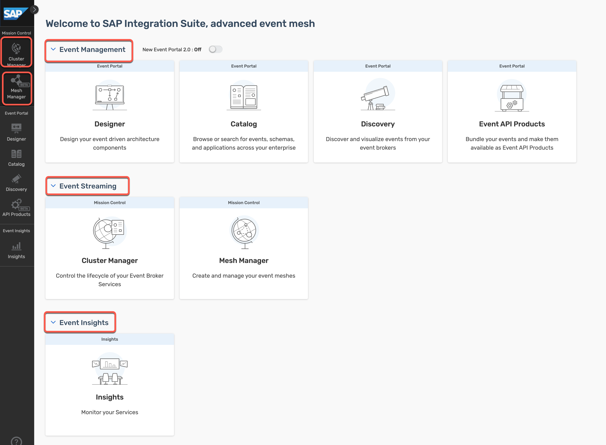

Check out the different areas in the Advanced Event Mesh cockpit , representing the different categories of services AEM offers

- Event Streaming: Mission Control makes it easy to deploy event brokers, create event meshes, and optimize and monitor the health/performance of an event-driven system. Mission Control is a section in the Cloud Console that permits you to access event brokers, visualize and manage your event broker services, and visualize and design event meshes. Mission Control has a Cluster Manager and Mesh Manager that permits you to create event broker services and manage your event mesh.

     - Cluster Manager: event broker services are made available via Cluster Manager. Each event broker service consists of event brokers configured in a High-Availability (HA) setup.

     - Mesh Manager: use Mesh Manager to connect multiple event broker services that span different data centers to create an event mesh. An event mesh is an architectural layer that allows events from one application to be dynamically routed and received by any other application no matter where these applications are deployed (no cloud, private cloud, public cloud). This layer is composed by a network of event broker services. Event broker services are a modern form of messaging middleware, which are designed to move events across the distributed enterprise.

- Event Management: Event Portal provides event management services. This subscribed service provides powerful tools to create, design, share, and manage various aspects of an EDA based on event brokers or other streaming technologies (such as Kafka).

- Event Monitoring and Insights: With Insights, we provide curated dashboards, easy-to-understand visualizations based on historical and real-time metrics, and timely notifications about your event broker services. This advanced information allows you to identify problems before they occur and helps you to better manage your services as your EDA scales. You can work with SAP to configure your monitoring to meet your needs. For advanced monitoring requirements, there's a single entry point to build custom visualizations to meet your organization's requirements. Coupled with visualizations is a notification email framework that alerts you when key metrics fall outside of your established thresholds. These notifications allow you to monitor what's occurring and correct developing issues before they impact or degrade your EDA. You can configure these notifications to integrate with your existing notification and logging systems.

3. Click on "**Cluster Manager**" and uncheck **"Only show my services"**. Select "**Broker Asia**".

  

4. Click on the Button on the right and press **"Open Broker Manager"**.

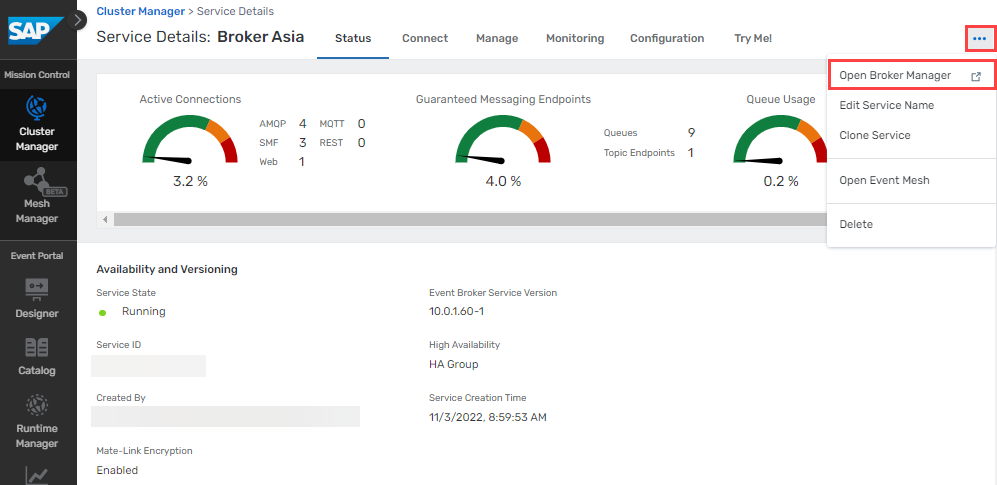  

5. Explore the Broker Manager

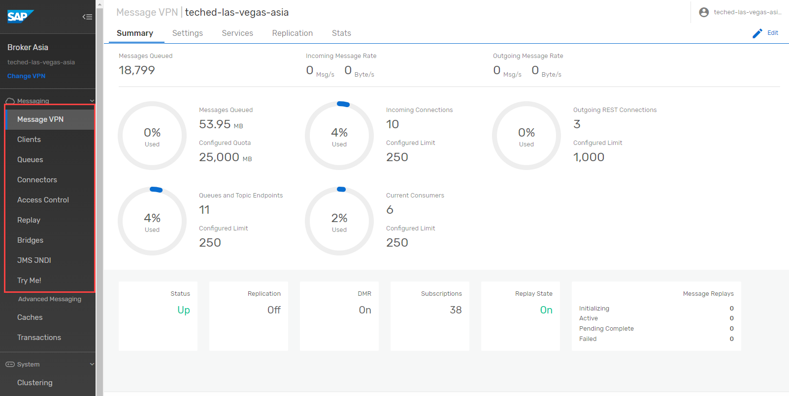  

On the left side of the screen are the main sections to navigate through:

- Message VPN: VPN-level stats and config (a Message VPN is a virtual partition of a single broker... one AEM broker can host multiple Message VPNs, and each VPN can have different authorization schemes and topic spaces; client/messaging application activity happens within the scope of a VPN)
- Clients: information about connected and configured client applications
- Queues: used for Guaranteed / persistent messaging
- Connectors: helpful wizards to connect to a variety of web services
- Access Control: where you create new client usernames, ACL profiles, and client profiles
- Replay: where you can enable replay, to allow the broker to send previous messages again NOTE: Solace brokers do not use replay for recovery of persistent data (like Kafka)... there is a more fine-grained approach in Solace where each individual message is ACKnowledged to the broker when the consumer application is done with it
- Try Me! this is where we will connect two WebSocket test applications

## Exercise 1.2 - Create a queue in Advanced Event Mesh

After completing these steps you will have created a queue in Advanced Event Mesh.

1. Go back to the original tab in your browser and click on **"Cluster Manager"** on the left.
2. In the All Services screen click on the **"Broker Asia"** tile.

HINT: If you cannot see the tiles, uncheck the "Only show my services" box.

  


3. Switch to **"Manage"** tab and click on the **"Queues""** tile. A new window opens up.

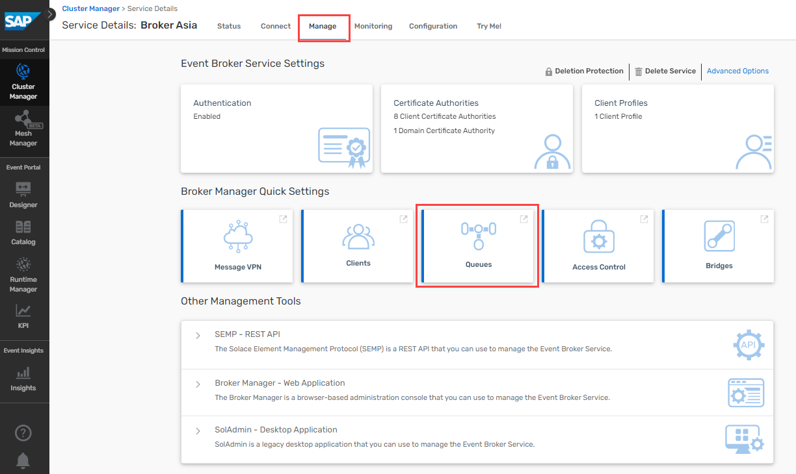     

4. Click the **"+Queue"** button on the top right.

        

5. In the pop up enter the queue name: User_**XXX** (replace **XXX** with your user number).

6. Click **"Create"**

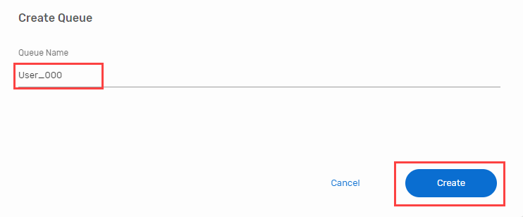      

7. On the next screen click **"Apply"**

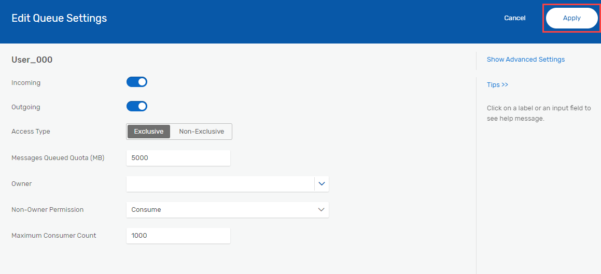      

8. Check whether you can find your queue in the list and click on it.

   

## Exercise 1.3 - Create a queue subscription in Advanced Event Mesh

9. Switch to tab **"Subscriptions"**.

10. Click on **"+ Subscription"**.

  

11. Enter following topic: **aif/businesspartner/change**

12. Click on **"Create"**.

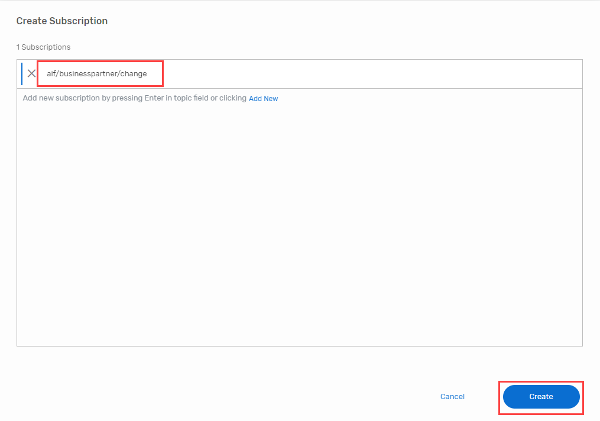  

13. Check on whether your queue subscription got created.

  

## Exercise 1.4 - Send an event from the Try Me! tool to your topic

14. Switch to the **"Try Me!"** Section in the menu on the right.

15. Press the **"expand"-Icon** to show the connection details. Please note, that the properties have to be adjusted, so the connection will not work. We will add them in the next steps.
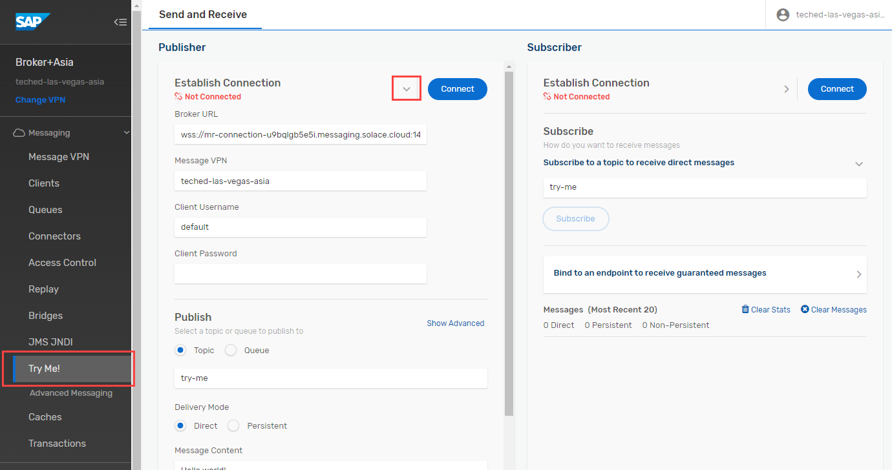 

16. Keep your current browser tab open and **go back to the other/main tab** and click on **"Connect"**. Select **View by "Protocol"**.

 

17. Open the **"Solace Web Messaging"** entry and select **"Solace JavaScript API"**. Now a Pop-up on the right shows use the connection details.

18.  Copy these details into the according properties of the "Try Me!" tool opened in step 14. Overwrite existing values.
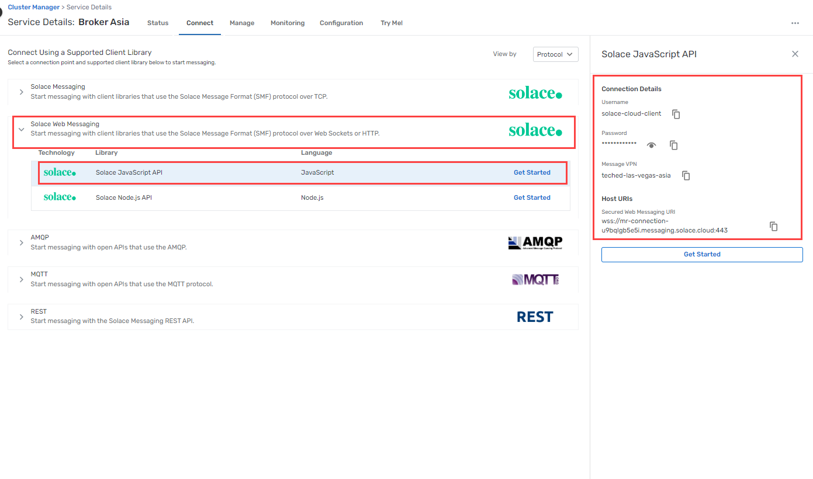 

19. Press **"Connect"**.
>**Important**: If your browser asks to select a certificate for authentication, press "Cancel" otherwise the connection will fail! If you accidentially clicked on a certificate, please restart your browser to show the dialog again.
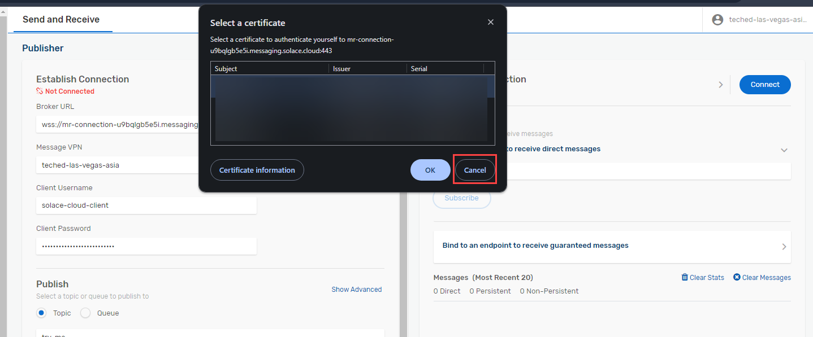  

20. Choose **"Queue"** and provide the name of the queue creted in step 5: User_**XXX** (replace **XXX** with your user number).

21. Change "Deliver Mode" to **"Persistent** and add following "Message Content":
```json
{
	"specversion": "1.0",
	"type": "aif.businesspartner.change",
	"source": "S4H/100",
	"datacontenttype": "application/json",
	"id": "iopoR}Qa7k{IeB7xyLljsm",
	"time": "2024-07-23T15:09:31Z",
	"data": {
		"BusinessPartner": "A10",
		"LastName": "John",
		"FirstName": "Doe",
		"Country": "DE",
		"City": "Walldorf",
		"PostCode": "69190",
		"Street": "Dietmar-Hopp-Allee",
		"HouseNumber": "16"
	}
}

```

19. Click **"Publish"** to send your message to your topic.

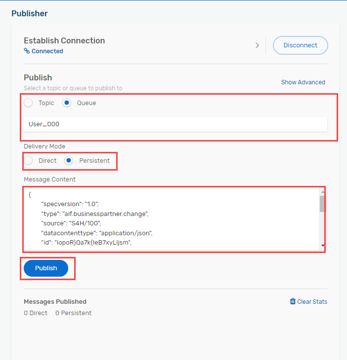  

20. You should see 1 message published in the Publish Status.

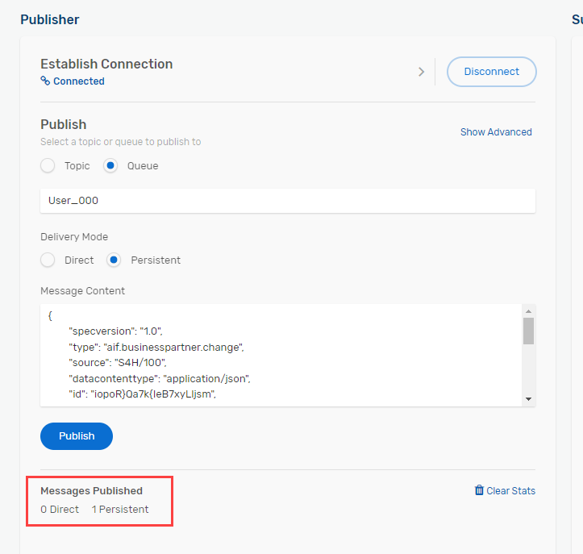  

21. Switch back to the tab **"Queues"** and click on your queue.

  

22. You should see 1 Message Queued.

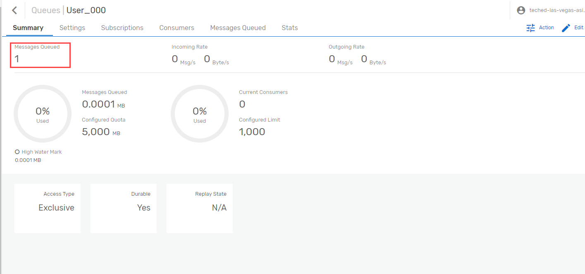  

You have sent a message to a topic, and via the subscription this message has been stored in your queue.

23. You can leave it like this or you can play the same game a little longer: go back to the Try Me! tool and just click publish, and see in the other tab how the count of messages gets increased (don't forget to refresh the page).

## Summary

You have now created a queue in AEM and have subscribed to events via a topic. You have sent events to this topic using the Try me! tool.

Please continue with [Exercise 2 - Use Cloud Integration for event mediation](../ex2/README.md)
