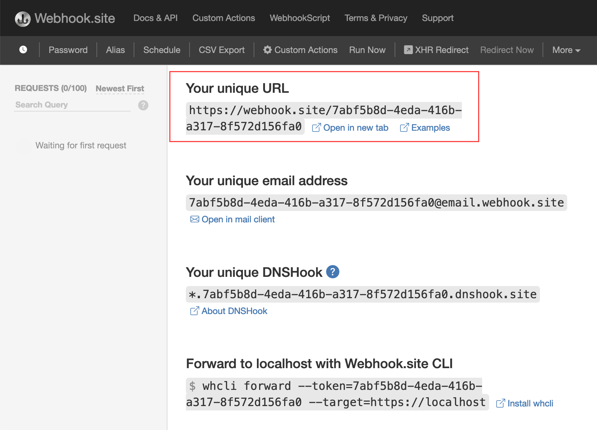
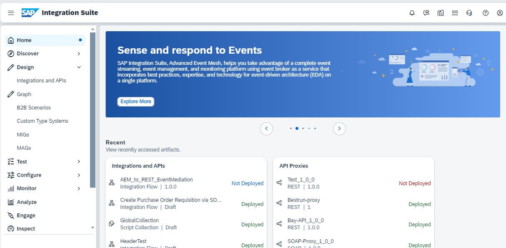
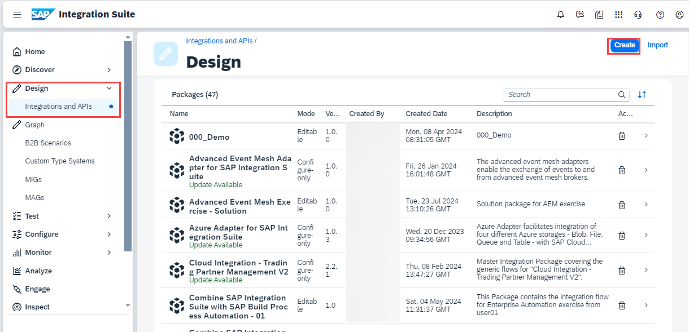
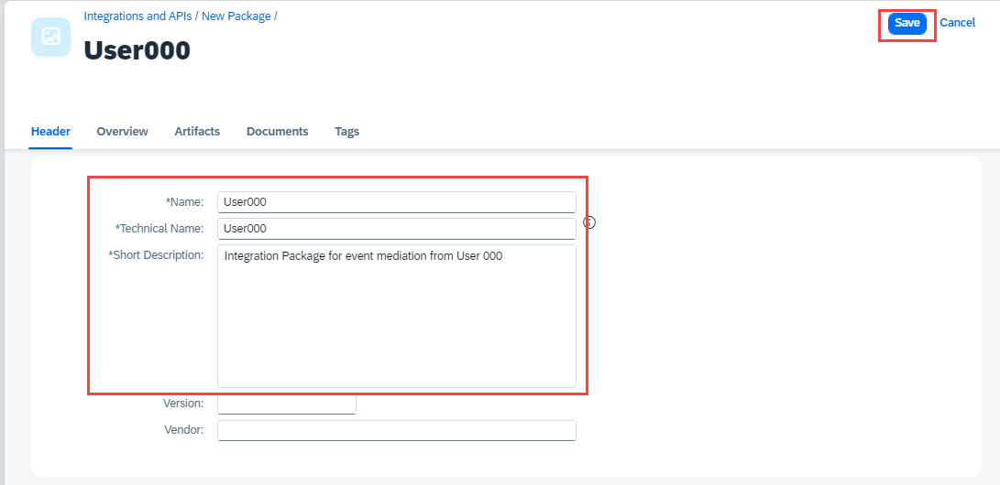
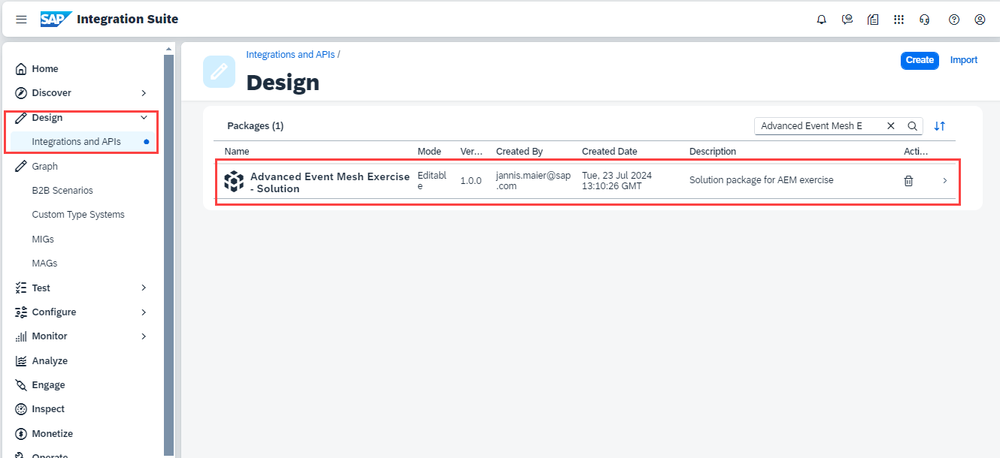
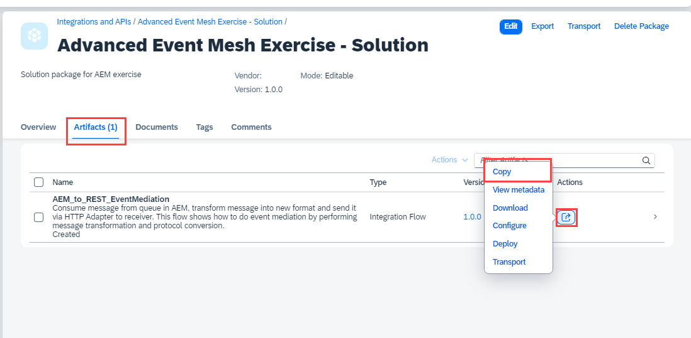

## Exercise 2 Use Cloud Integration capablity for event mediation

In this exercise you will create an Integration Flow which subscribes to the Queue created in exercise 1 via Advanced Event Mesh adapter using the Solace Messaging Format (SMF).

## 2.1 Setup REST Endpoint

Before we start creating our integrtaion flow, we will need to do a bit of a setup. First, we will "provision" a simple HTTP endpoint, where we will send the message.

### webhook.site (HTTP endpoint)

For simplicity purposes, our REST consumer will be a simple HTTP endpoint that will receive the messages from the queue. We will use a tool called [Webhook.site](https://webhook.site/) to create a temporary endpoint that will receive the messages. When you navigate to the website, you will be presented with a unique URL that you can use to receive the messages. Take note of the unique URL as we will use it to configure the REST consumer.

     
    <i>webhook.site example</i>

## 2.2 Create Integration Package

1. Open the to the SAP Integration Suite landing page.
   

2. Navigate to  <b>Design > Integrations</b>, and select  <b>Create</b>.
   
   
2. Fill in following **Name:** user**XXX** where <b>XXX</b> is your user number and a short <b>description</b> eg. "Integration Package for event mediation from User 000". Then click <b>Save</b>.
   

## 2.3 Copy & Configure Integration Flow

1. Navigate to  <b>Design > Integrations</b>.
   

2. Seach for the package "Advanced Event Mesh Exercise - Solution" and select it.
   

3. Navigate to tab **"Artifacts"** select the **"Action"-button** and press **"Copy"**
 

4. Change the name to AEM_to_REST_EventMediation_User**XXX** and replace **XXX** with your user id. Press the **"Select"** button to select the desitnation package.

5. 

## 2.4. Monitor Messages

